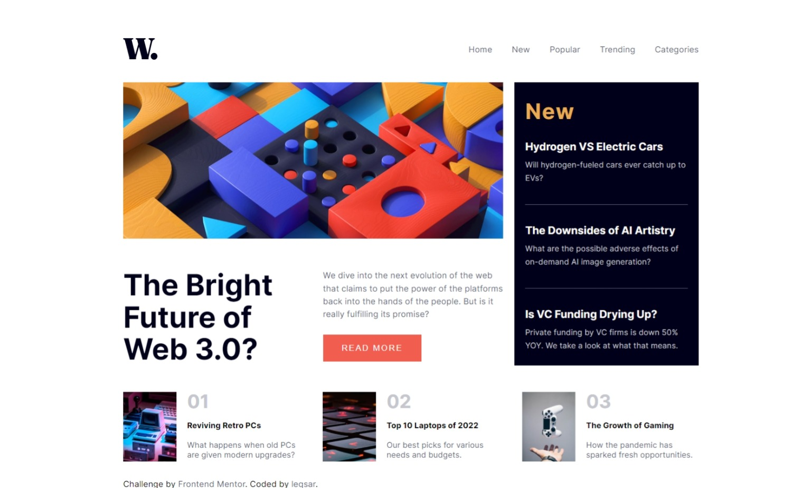

# Frontend Mentor - News homepage solution

This is a solution to the [News homepage challenge on Frontend Mentor](https://www.frontendmentor.io/challenges/news-homepage-H6SWTa1MFl). Frontend Mentor challenges help you improve your coding skills by building realistic projects. 

## Table of contents

- [Overview](#overview)
  - [The challenge](#the-challenge)
  - [Screenshot](#screenshot)
  - [Links](#links)
- [My process](#my-process)
  - [Built with](#built-with)
  - [What I learned](#what-i-learned)
  - [Continued development](#continued-development)
  - [Useful resources](#useful-resources)
- [Author](#author)

## Overview

### The challenge

Users should be able to:

- View the optimal layout for the interface depending on their device's screen size (1100px and 400px)
- See hover and focus states for all interactive elements on the page

### Screenshot

### Links

- Solution URL: [https://www.frontendmentor.io/solutions/responsive-landing-page-using-css-grid-fgfpcKL3O2](https://your-solution-url.com)
- Live Site URL: [https://leqsar.github.io/news-homepage-grid/](https://your-live-site-url.com)

## My process

### Estimated time

2 hours

### Actual time

2.5 hours

### Built with

- Semantic HTML5 markup
- CSS Grid
- Native JS

### What I learned

Reminded myself of some CSS Grid practices.

### Continued development

During developing this small homepage I found CSS Grid layout pretty useful, so I'm looking forward to gain more experience with it.

### Useful resources

- [https://css-tricks.com/snippets/css/complete-guide-grid/](https://www.example.com) - This helped me to remind myself of some grid properties.

## Author

- Frontend Mentor - [@leqsar](https://www.frontendmentor.io/profile/leqsar)

